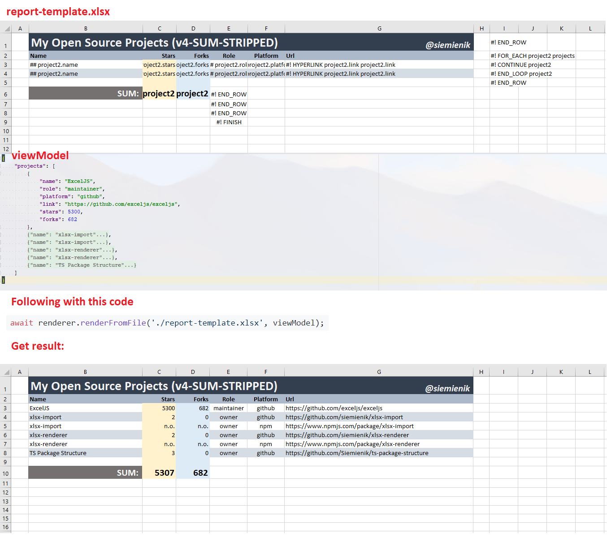

[](https://github.com/Siemienik/xlsx-renderer/actions)[](https://snyk.io/test/github/siemienik/xlsx-renderer)[](https://codecov.io/gh/Siemienik/xlsx-renderer)

[](https://www.npmjs.com/package/xlsx-renderer)


# Introduction

This amazing library makes generating excel files as simple as possible - it is enough one line to generate pretty customizable spreadsheet file.

## Use case

1. **Are you feeling nervous when the business wants to change the invoice layout?**
Now you may say "bye bye" to changing thousands of line codes. It is enough to update `invoice-template.xlsx` and use with this tool.

2. **Do you need generate complex report?**
Imagine that it will not be terrible too much. Commonly generating files requires to write a lot of lines of code (for instance get cell A1, set font bold, border solid, test etc.). Whith this tool you may use Microsoft Excel to fancy create `complex-report.xlsx` and mix it with your data by using xlsx-renderer.

3. **Did the boss said that it is only a little change in `sales-report.xlsx`, but it isn't?**
Whith `xlsx-renderer` you musn't change any line of code, just update your `template.xlsx`

## How it works?

It consumes template which is common Excel file, then add yours data called view model. Blend it and done, as result you'll get result file.


## Supported projects by me:

* [](https://www.npmjs.com/package/xlsx-renderer) [XLSX-renderer](https://github.com/Siemienik/xlsx-renderer) - makes generating excel files as simple as possible - it is enough one line to generate pretty customizable spreadsheet file.
* [](https://www.npmjs.com/package/xlsx-import) [XLSX-import](https://github.com/Siemienik/xlsx-import) - just define how data is located inside the spreadsheet file and import an array by write one line.
* [ts-package-structure](https://github.com/Siemienik/ts-package-structure) - the robust structure which I use to creating packages.

I am also proud of myselt to being one of [ExcelJS](https://github.com/exceljs/exceljs)'s maintainers and I use this experience to make all of these tools better.

# Getting Started:

1. install package

```
npm i xlsx-renderer --save
```

## Sample code:

```ts
import {Renderer} from 'xlsx-renderer';
// ...
const renderer = new Renderer();
// ... 
const viewModel = { awesome:"Oh yeah!", items:[/*...*/] };
const result = await renderer.renderFromFile('./report-template.xlsx', viewModel);
await result.xlsx.writeFile('./my-awesome-report.xlsx');
```

## More examples:

for more example I invite to tests data: [click here and check `Renderer` folders](./tests/integration/data)

# Documentation:

## Cells:

| Category | Name | Order | match rule | Description | More info |
|----------|-----:|-------|--------|-------------|:---------|
| - | [BaseCell](./src/cell/BaseCell.ts) | n/o | n/o | All Cell\`s definition classes extend it. | **abstract** |
| Content | [NormalCell](./src/cell/NormalCell.ts) | 1 | not started by `##` or `#!` | This one copy all styles, width, properties and value form template.  | **default** |
| Content | [VariableCell](./src/cell/VariableCell.ts) | 3 | `## pathToVariable ` | Write variable from `ViewModel`. <br/> Paths to object's property or array item are allowed.<br/> When asking about undefined variable it returns empty string. | **Paths examples:** <br/> `simplePath` <br/> `someObject.property` <br/> `array.0.field` <br/> `items.1.path.to.object.prop`|
| Content | [HyperlinkCell](./src/cell/HyperlinkCell.ts) | 5 | `#! HYPERLINK pathToLabel pathToTarget` | Create a hyperlink. | *Paths resolve exactly same as VariableCell* |
| Content | [FormulaCell](./src/cell/FormulaCell.ts) | 4 | Cell.type eq. formulae | It handles correctly formulas inside and outside of loops - when rows were shifted compared to the template. | *It is used automatically when formulae from the template being rendered* <br/> [Example](./tests/integration/data/Renderer010-ForEach-Formula/)|
| Navigation | [EndRowCell](./src/cell/EndRowCell.ts) | 2 | `#! END_ROW` | Go to the beginning of next row |  |
| Worksheet<br/>Navigation<br/>Loop | [FinishCell](./src/cell/FinishCell.ts) | 7 | `#! FINISH conditionPath` | Finish rendering for current worksheet and: <br/> 1) go to next worksheet if `conditionPath===true`<br/> 2) repeat this template worksheet again (`conditionPath === false`) - looping through worksheets <br/> 3) finished whole rendering when this worksheet is the last one.   | **Examples:**<br/> `#! FINISHED ` or `#! FINISHED itemFromLoop.__iterated` |
| Worksheet | [WsNameCell](./src/cell/WsNameCell.ts) | 13 | `#! WS_NAME pathToVariable` | Set worksheet's name.  | **Examples:** <br/> `#! WS_NAME worksheetName` <br/> `#! WS_NAME item.title` <br/> `#! WS_NAME translatedNames.0` |
| Loop | [DumpColsCell](./src/cell/DumpColsCell.ts) | 10 | `#! DUMP_COLS pathToArray` | Useful for writing through multiple columns. It put each value of array to next column. | [Example](./tests/integration/data/Renderer011-DumpCols/) |
| Loop | [ForEachCell](./src/cell/ForEachCell.ts) | 6 | #! FOR_EACH item items | Begin the loop named `item`, set the first element of `items` into `item` and go to the beginning of next line.| Connected to: `ContinueCell`, `EndLoopCell`, `DeleteCell`, `FinishedCell`, `SumCell`, `AverageCell`. |
| Loop | [ContinueCell](./src/cell/ContinueCell.ts) | 9 | `#! CONTINUE item` | Iterate to next element of loop named `item` (check `ForEachCell` for more information) and navigate to the beginning of new line. | |
| Loop | [EndLoopCell](./src/cell/EndLoopCell.ts) | 8 | `#! END_LOOP item` | Mark cell when the loop `item` finished. | |
| Aggregation| [SumCell](./src/cell/SumCell.ts) | 11 | `#! SUM item` | Write sum formulae for current column and the `item`'s rows.  | [Example](./tests/integration/data/Renderer007-ForEach-Sum/) |
| Aggregation | [AverageCell](./src/cell/AverageCell.ts) | 12 | `#! AVERAGE item` | Write average formulae for current column and the `item`'s rows.  | [Example](./tests/integration/data/Renderer009-ForEach-Average/) |
| View Model | [DeleteCell](./src/cell/DeleteCell.ts) | 14 | `#! DELETE pathToVariable` | Delete variable, useful for nested loops.|  [Example](./tests/integration/data/Renderer009-ForEach-Average/)  |

# Supported platforms:

## Node:

| Node version |  10 |  11 |  12 |  13 |  14 |
|--------------|-----|-----|-----|-----|-----|
| Supported?   | 🟢 |  🟢 | 🟢 |  🟢 | 🟢 |

Discovered in: [#14](https://github.com/Siemienik/xlsx-renderer/issues/14)

## Browsers:

Scheduled to check in issue: [#13](https://github.com/Siemienik/xlsx-renderer/issues/13)

[MIT LICENSE](LICENSE)
